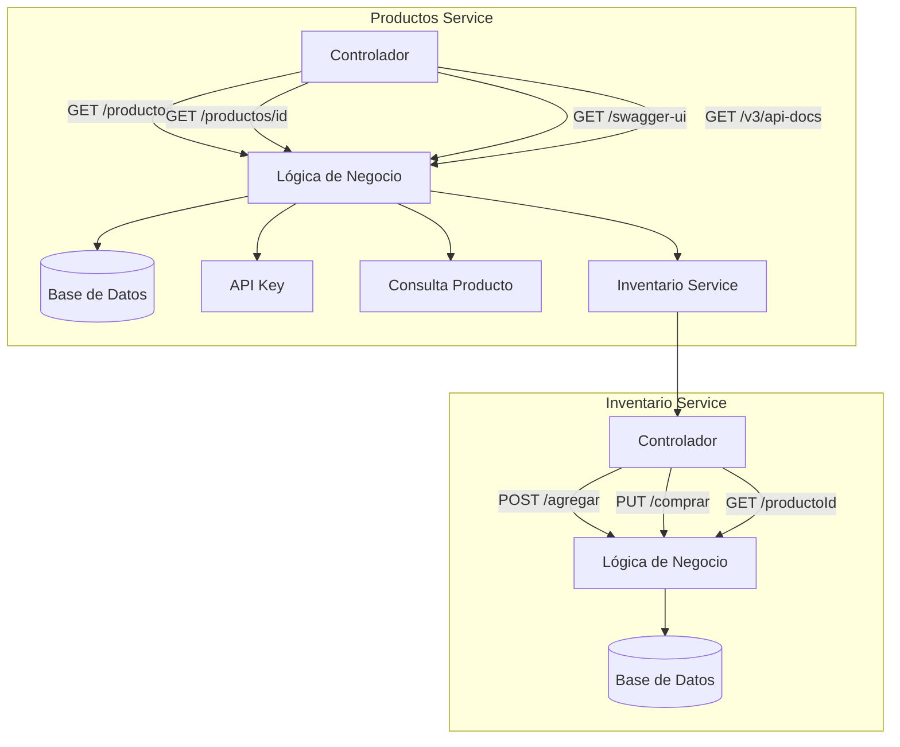

# Sistema de Gestión de Productos e Inventario

Este repositorio contiene dos microservicios diseñados con **Spring Boot** que forman parte de un sistema distribuido para gestionar productos e inventario. Implementa principios de arquitectura limpia, desacoplamiento, y está preparado para integrarse en un ecosistema de microservicios.

---

## 🧱 Arquitectura del Sistema

El sistema sigue una arquitectura basada en microservicios con responsabilidades separadas:

```
+---------------------+       REST        +-------------------------+
| Productos Service   |  <------------->  | Inventario Service      |
+---------------------+                   +-------------------------+
| CRUD productos      |                   | Gestión de inventario   |
| Validaciones & DTOs |                   | Historial de compras    |
| Seguridad (API Key) |                   | Feign hacia productos   |
+---------------------+                   +-------------------------+
```

Cada servicio cuenta con controladores, servicios, excepciones, DTOs y configuración propia.




---

## 📂 Distribución de Carpetas

### Productos Service

```
src/main/java/com/linktic/productos/
├── config/               # Swagger, Interceptor, WebConfig
├── controller/           # Controladores REST
├── dto/                  # DTOs de entrada y salida
├── exception/            # Manejo de errores y excepciones
├── service/              # Lógica de negocio
└── ProductosServiceApplication.java
```

### Inventario Service

```
src/main/java/com/linktic/inventario/
├── client/               # Cliente Feign hacia Productos
├── config/               # Swagger, Interceptor, WebConfig
├── controller/           # Controladores REST
├── dto/                  # DTOs de entrada y salida
├── exception/            # Manejo de errores
├── mapper/               # Conversores entre entidades y DTOs
├── model/                # Entidades JPA
├── repository/           # Interfaces de acceso a datos
└── InventoryApplication.java
```

---

## 🚀 Tecnologías utilizadas

- Java 17
- Spring Boot
- Spring Web
- Spring Data JPA
- Feign Client
- Swagger (OpenAPI)
- PostgreSQL
- Maven
- JUnit / Mockito

---

## ⚙️ Configuración del entorno

### PostgreSQL

Configura tu base de datos en `application.properties`:

```properties
spring.datasource.url=jdbc:postgresql://localhost:5432/inventario_db
spring.datasource.username=postgres
spring.datasource.password=tu_contraseña
spring.jpa.hibernate.ddl-auto=update
spring.jpa.show-sql=true
```

---

## 🧪 Endpoints REST

### Productos Service (`http://localhost:8080/api`)

- `POST /v1/productos` – Crear producto
- `GET /v1/productos` – Listar productos
- `GET /v1/productos/{id}` – Obtener producto
- `PUT /v1/productos/{id}` – Actualizar producto
- `DELETE /v1/productos/{id}` – Eliminar producto

### Inventario Service (`http://localhost:8081/api`)

- `POST /v1/inventario/agregar` – Agregar stock
- `POST /v1/inventario/compra` – Registrar compra
- `GET /v1/inventario/{productoId}` – Consultar inventario por producto

---

## 🔐 Seguridad

El servicio de productos requiere una clave API en las cabeceras HTTP:

```
X-API-KEY: tu_api_key_aqui
```

---

## 🔄 Comunicación entre servicios

El Inventario Service se comunica con el Productos Service usando un cliente Feign:

```java
@FeignClient(name = "producto-service", url = "${producto.service.url}")
public interface ProductoClient {
    @GetMapping("/api/producto/{id}")
    ProductoClientResponse obtenerProducto(@PathVariable Long id);
}
```

---

## 🧪 Pruebas

Ejecuta pruebas con:

```bash
mvn test
```

Pruebas de integración y unitarias se encuentran en las carpetas:

- `src/test/java/com/linktic/productos/integration/`
- `src/test/java/com/linktic/inventario/`

---

## 🐳 Contenedores y despliegue

Ambos servicios pueden contenerizarse con Docker.

### Dockerfile

```dockerfile

# Productos
FROM openjdk:17-jdk-slim
WORKDIR /app
COPY target/productos-service-1.0.0.jar app.jar
EXPOSE 8080
ENTRYPOINT ["java", "-jar", "app.jar"]

# Inventario
FROM openjdk:17-jdk-slim
WORKDIR /app
COPY target/inventario-service-1.0.0.jar app.jar
EXPOSE 8081
ENTRYPOINT ["java", "-jar", "app.jar"]

```

### docker-compose.yml

```yaml

services:
  postgres-productos:
    image: postgres:13
    container_name: postgres-productos
    environment:
      POSTGRES_DB: productos_db
      POSTGRES_USER: postgres
      POSTGRES_PASSWORD: postgres
    ports:
      - "5432:5432"
    volumes:
      - postgres_productos_data:/var/lib/postgresql/data
    networks:
      - microservices-network

  postgres-inventario:
    image: postgres:13
    container_name: postgres-inventario
    environment:
      POSTGRES_DB: inventario_db
      POSTGRES_USER: postgres
      POSTGRES_PASSWORD: postgres
    ports:
      - "5433:5432"
    volumes:
      - postgres_inventario_data:/var/lib/postgresql/data
    networks:
      - microservices-network

  productos-service:
    build:
      context: ./productos-service
      dockerfile: Dockerfile
    container_name: productos-service
    ports:
      - "8080:8080"
    environment:
      - SPRING_DATASOURCE_URL=jdbc:postgresql://postgres-productos:5432/productos_db
      - SPRING_DATASOURCE_USERNAME=postgres
      - SPRING_DATASOURCE_PASSWORD=postgres
    depends_on:
      - postgres-productos
    networks:
      - microservices-network

  inventario-service:
    build:
      context: ./inventario-service
      dockerfile: Dockerfile
    container_name: inventario-service
    ports:
      - "8081:8081"
    environment:
      - SPRING_DATASOURCE_URL=jdbc:postgresql://postgres-inventario:5432/inventario_db
      - SPRING_DATASOURCE_USERNAME=postgres
      - SPRING_DATASOURCE_PASSWORD=postgres
      - PRODUCTOS_SERVICE_URL=http://productos-service:8080
    depends_on:
      - postgres-inventario
      - productos-service
    networks:
      - microservices-network

volumes:
  postgres_productos_data:
  postgres_inventario_data:

networks:
  microservices-network:
    driver: bridge
```
---

### Despliegue
- docker compose up -d --build

---

## 📘 Documentación Swagger

- Productos: `http://localhost:8080/api/swagger-ui/index.html`
- Inventario: `http://localhost:8081/api/swagger-ui/index.html`

---

## 🧑‍💻 Autor

Desarrollado por **Alexander Rubio Cáceres**.

---

## 📝 Licencia

Este proyecto está bajo la licencia MIT. Puedes usarlo, modificarlo y distribuirlo libremente.
